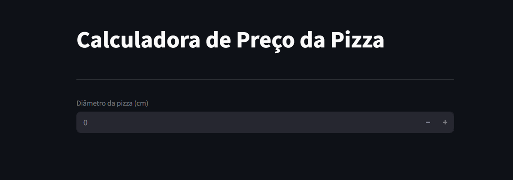

🍕 Calculadora de Preço da Pizza

Uma aplicação interativa feita com Streamlit que prevê o preço de uma pizza com base em seu diâmetro utilizando regressão linear. Simples, prática e deliciosa! 😄

🚀 Sobre o Projeto
Esta calculadora utiliza um modelo de Regressão Linear treinado com dados históricos de pizzas (diâmetro e preço) para estimar o valor de uma nova pizza com base no seu tamanho.

🧠 Como Funciona
O usuário informa o diâmetro da pizza (em cm).

O modelo prevê o preço com base no aprendizado a partir de um arquivo CSV (pizzas.csv) contendo dados reais.

O preço previsto é exibido com uma animação de balões 🎈 para comemorar!

📂 Estrutura dos Arquivos
app.py — Código principal da aplicação.

pizzas.csv — Dataset com os dados usados para treinar o modelo.

🧾 Código
python
Copiar
Editar
import streamlit as st
import pandas as pd
from sklearn.linear_model import LinearRegression

# Leitura dos dados
df = pd.read_csv('pizzas.csv')

# Treinamento do modelo
modelo = LinearRegression()
x = df[['diametro']]
y = df[['preco']]
modelo.fit(x, y)

# Interface do usuário
st.title('Calculadora de Preço da Pizza')
st.divider()

diametro = st.number_input('Diâmetro da pizza (cm)', min_value=0)

if diametro:
    preco_previsto = modelo.predict([[diametro]])[0][0]
    st.write(f'O preço previsto para uma pizza de {diametro} cm é R$ {preco_previsto:.2f}')
    st.balloons()
🛠 Requisitos
Python 3.7+

Bibliotecas:

streamlit

pandas

scikit-learn

Instale com:

bash
Copiar
Editar
pip install streamlit pandas scikit-learn
▶️ Executando o App
bash
Copiar
Editar
streamlit run app.py
Abra o link exibido no terminal e aproveite! 🍕

📈 Exemplo de Dataset (pizzas.csv)
csv
Copiar
Editar
diametro,preco
20,30
25,40
30,50
35,60